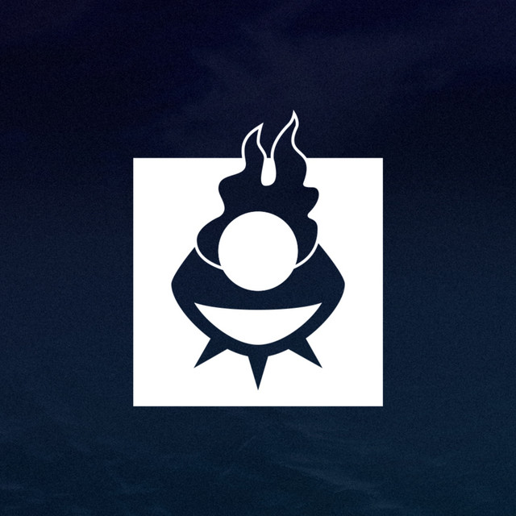

</img>

# 🕊️ Jumas Seberi

### Juventude Masculina de Schoenstatt

---

## 📖 Sobre Nós

Bem-vindo à organização oficial do **Jumas Seberi** no GitHub! 

A **Juventude Masculina de Schoenstatt (JUMAS)** é um ramo do Movimento de Schoenstatt dedicado à formação integral de jovens e adolescentes do sexo masculino. Em Seberi, RS, nosso grupo busca desenvolver líderes cristãos comprometidos com a transformação da sociedade através da vivência dos valores do Evangelho e do carisma de Schoenstatt.

## 🎯 Nossa Missão

Nossa missão é formar **homens novos** para tempos novos, capazes de:

- 🙏 **Cultivar** uma vida espiritual profunda e autêntica
- 🤝 **Construir** relacionamentos fraternos e significativos
- 💪 **Desenvolver** o caráter e a liderança cristã
- 🌍 **Transformar** a realidade social à sua volta
- ✨ **Viver** os ideais de Schoenstatt no cotidiano

## 💡 O que é Schoenstatt?

Schoenstatt é um **Movimento Internacional da Igreja Católica** fundado pelo Pe. José Kentenich em 1914, na Alemanha. Com uma pedagogia própria e inovadora, Schoenstatt busca formar pessoas livres, comprometidas e capazes de construir uma nova cultura em aliança com Maria, a Mãe de Deus.

O nome "Schoenstatt" significa "**lugar bonito**" em alemão e representa tanto o local físico de origem do movimento quanto o ideal de transformar cada coração em um santuário.

## 🚀 Nossos Projetos

Nesta organização, você encontrará:

- 📱 **Aplicações e ferramentas** desenvolvidas para apoiar as atividades do Jumas
- 📚 **Recursos educacionais** e materiais de formação
- 🎨 **Projetos criativos** e de comunicação

## 🌟 Valores que nos guiam

- **Aliança de Amor** com Maria, Mãe e Educadora
- **Homem Novo** comprometido com Cristo
- **Cultura de Aliança** e solidariedade
- **Pedagogia da Liberdade** e responsabilidade
- **Vinculação** com a Igreja e a sociedade

## 🤝 Como Participar

Se você é de Seberi ou região e tem interesse em conhecer o Jumas:

1. Entre em contato conosco através das redes sociais
2. Participe de nossos encontros e atividades
3. Conheça nossa comunidade e nossos projetos
4. Junte-se a nós nesta caminhada de fé e amizade!

## 📞 Contato

- 📱 **Instagram**: [@jumasseberi](https://www.instagram.com/jumasseberi)
- 🌐 **Website**: [jumas-seberi.vercel.app](https://jumas-seberi.vercel.app)
- 📍 **Local**: Seberi, Rio Grande do Sul, Brasil

## 🔗 Links Úteis

- [Jumas Brasil](https://jumasbrasil.com.br/)
- [Schoenstatt Brasil](https://www.schoenstatt.org.br)
- [Juventude Masculina de Schoenstatt](https://www.schoenstatt.org.br/juventude-masculina)
- [Movimento de Schoenstatt Internacional](https://www.schoenstatt.org)

---

### 🕊️ "Nada sem ti, nada sem nós!" - Pe. José Kentenich

**Feito com ❤️ pelo Jumas Seberi**

